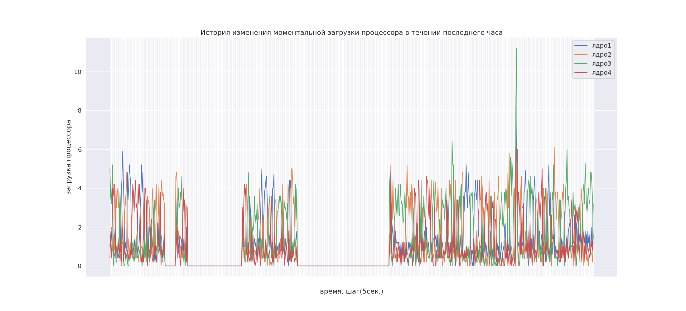
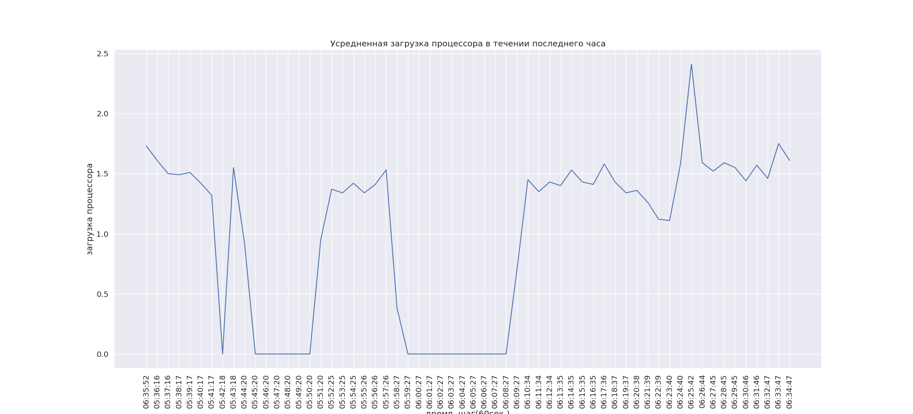
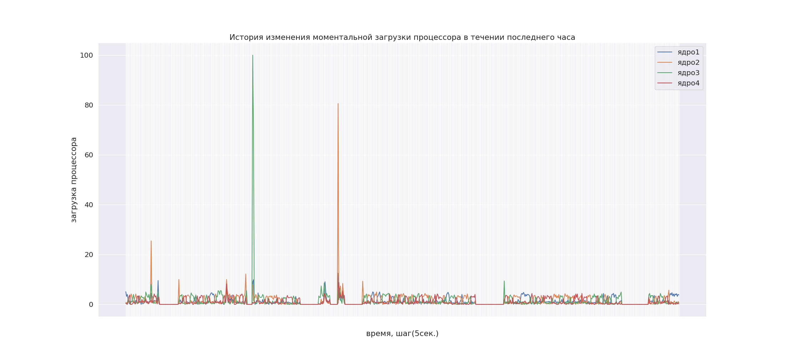
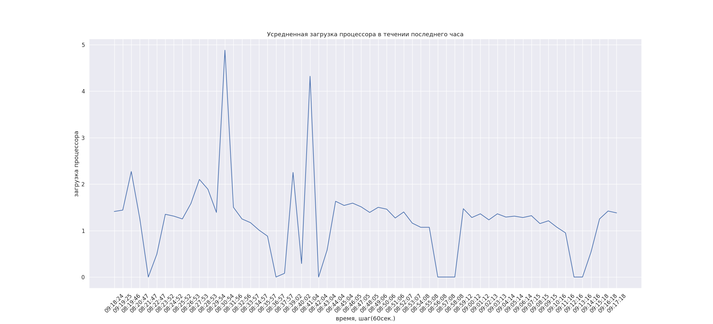

# Тестовое задание
### Разработка веб сервиса, который:
### Задание №1 — Постоянно сохраняет в БД историю величины загрузки процессора с интервалом в 5 сек.
#### Решение:
Использование Celory (распределенная асинхронная очередь заданий) в качестве модуля для постоянной записи данных в БД. Для сбора информации по загрузке процессора использовалась библиотека: psutil

**Например:**

Постановка задачи по нажатию кнопки "старт'
```shell
  process = start_script_insert_date.delay()
  process_id_1 = process.id
```
Закрытие задачи по нажатию кнопки "стоп"
```shell
    celeryapp = Celery('app', broker="redis://app_redis:6379/0", backend="redis_uri")
    celeryapp.control.revoke(process_id_1, terminate=True)
```

Celery используется в связке с redis.

В качестве БД используется PostgreSQL и веб сервис pgadmin.
### Задание №2 — Предоставляет страницу, которая изображает срез данных за последний час в виде двух графиков.
#### Решение:
В качестве веб фреймворка используется Django. Для создания фронтэнда части сервиса использовались: HTML и Bootstrap v5.2. Графики строились на основе полученных данных из БД, записанных в csv файл и обработанных с помощью библиотеки pandas. Работа с БД PostgreSQL осуществлялась засчет raw запросов. Для построения графиков использовались библиотеки: matplotlib и seaborn.
На веб странице предоставляется возможность управления сервисом по записи данных о процессоре в БД: 
- кнопка 'старт' - запускает сервис в фоновом режиме;
- кнопка 'стоп' - приостанавливает сервис;
- кнопка 'сброс' - полное стирание ранее записанных данных в БД;
- кнопка 'создать график' - запускает сбор и обработку данных в фоне для построения графиков;
- кнопка 'показать график' - отображает на странице построенные графики по данным.

На веб странице также доступна текущая информация по статусу состояния сервиса.
#### График №1

История изменения моментальной загрузки процессора в течении часа с интревалом 5 сек.

#### График №2

Усредненная загрузка процессора(среднее значение за 1 мин.)

#### График №3   по аналогии с графиком №1


#### График №4   по аналогии с графиком №2


Сервис упакован в Docker. Для запуска достаточно находиться в директории с файлом _'manage.py'_ и в терминале ввести следующее:
```shell
    docker-compose build
    docker-compose up
```